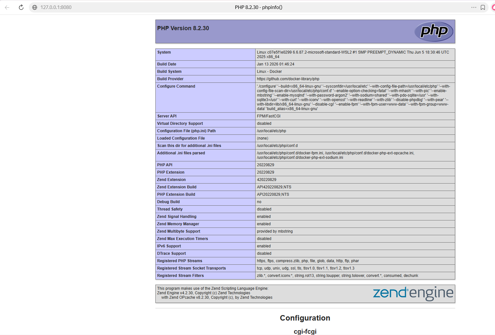

Лабораторная работа №2. Настройка Nginx + PHP-FPM. Основы HTML-форм и обработка на JavaScript.
👩‍💻 Автор
ФИО: Труфанов Даниил Олегович
Группа: ПМИ2 

📌 Описание задания
У вас есть результат первой лабораторной: проект в Docker с Nginx, HTML-страницей.
Теперь необходимо расширить его, добавив контейнер с PHP-FPM и доработав Nginx.
Результат доступен по адресу http://127.0.0.1:8080/form.html.

⚙️ Как запустить проект
Клонировать репозиторий:
git clone <ссылка на репозиторий>
cd nginx-lab
Запустить контейнеры:

docker-compose up -d --build
Открыть в браузере: http://127.0.0.1:8080/form.html 📂 Содержимое проекта

docker-compose.yml — описание сервиса Nginx

code/index.html — главная HTML-страница

screenshots/ — все скриншоты

📸 Скриншоты работы

✅ Результат html-страница работает, создана форма по условию, добавлены некоторые css стили. 